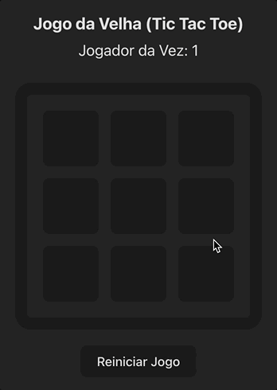

# 👨🏻‍💻 Desafio Técnico - Tic Tac Toe

## 🙃 ❤️ Preview



## 📋 Descrição

Este projeto é uma implementação funcional do jogo da velha (Tic Tac Toe). O objetivo é desenvolver um jogo completo que permita a dois jogadores competirem em um tabuleiro 3x3. O projeto utiliza técnicas de estilização de sua escolha, como CSS Modules, SASS, ou Styled Components.

## ✅ Funcionalidades

- [x] **Tabuleiro 3x3**: O jogo é jogado em um tabuleiro de 3x3 células.
- [x] **Dois Jogadores**: Permite que dois jogadores façam suas jogadas alternadamente.
- [x] **Preenchimento de Jogadas**: Ao clicar em um quadrado, ele será preenchido com a jogada do jogador atual.
- [x] **Finalização do Jogo**: O jogo avisa quando um jogador vence ou quando ocorre um empate (velha).

## 🔨 Como Rodar o Projeto

1. **Clone o repositório**:

```bash
git clone https://github.com/bmenegidio/react-challenge-tic-tac-toe.git
```

2. **Navegue até o diretório do projeto**:

```bash
cd react-challenge-tic-tac-toe
```

3. **Instale as dependências**:

```bash
npm install # ou o seu gerenciador de dependências favorito
```

4. **Inicie o servidor de desenvolvimento**:

```bash
npm run dev
```

5. **Abra o navegador**:

```bash
vá para http://localhost:5173 para ver a aplicação em execução
```
